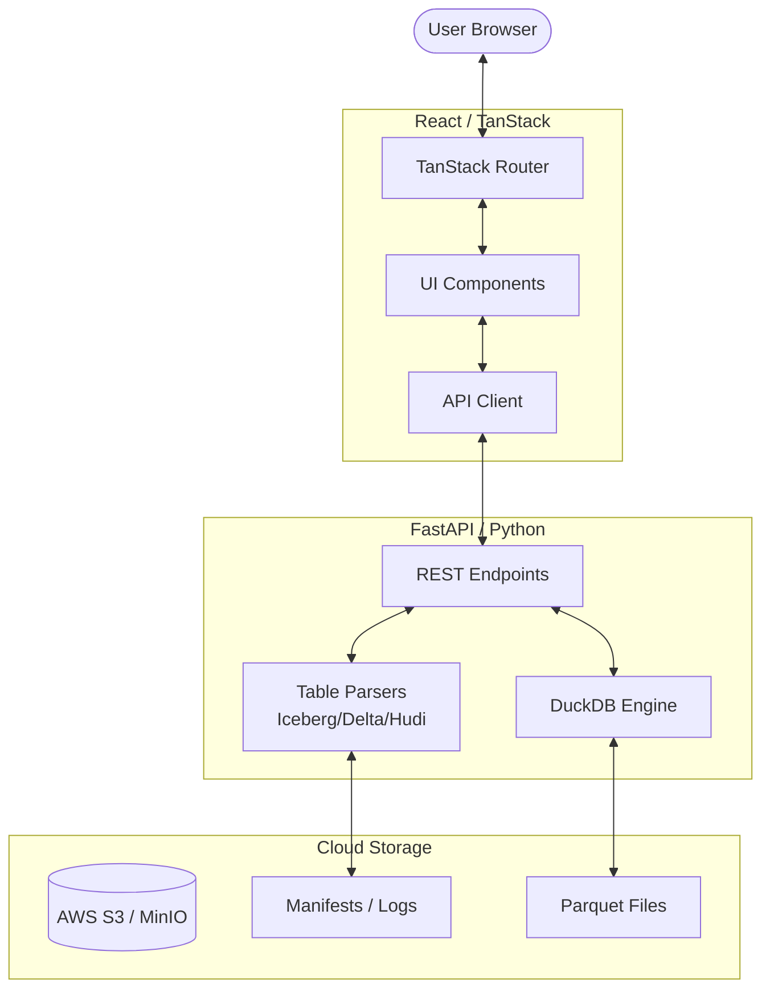

# NexaGlint: Lakehouse Metastore Viewer

NexaGlint is a high-performance, infrastructure-free metastore viewer designed for the modern data lakehouse. It allows data engineers and analysts to inspect **Iceberg**, **Delta Lake**, **Hudi**, and raw **Parquet** tables directly from S3-compatible storage without needing a running Hive Metastore or AWS Glue service.

## 🚀 Live Demo
- **Frontend (Vercel)**: [https://nexa-glint-meta-store-viewer-nfqu.vercel.app](https://nexa-glint-meta-store-viewer-nfqu.vercel.app)
- **Backend API (Render)**: [https://nexaglint-api.onrender.com/api/docs](https://nexaglint-api.onrender.com/api/docs)

## ✨ Key Features

- **Instant Table Discovery**: Automatically scan S3 buckets to find table roots across multiple formats.
- **Deep Metadata Inspection**: View schemas, partition keys, and file-level statistics.
- **Snapshot Timeline**: Walk through the history of Iceberg snapshots and Delta versions.
- **In-Browser SQL**: Run analytical queries directly on your S3 data using the built-in DuckDB engine.
- **Table Watching**: Track schema drift and new snapshots with real-time notifications.
- **Zero Infra Cost**: Runs entirely as a lightweight web app—no expensive clusters required.

## 🏗️ Architecture Flow



## 🚀 Getting Started

### 1. Backend Setup
```bash
cd backend
pip install -r requirements.txt
uvicorn main:app --reload
```

### 2. Frontend Setup
```bash
cd frontend
npm install
npm run dev
```

## 🌍 Deployment Steps (Summary)

To deploy the platform for free:
1.  **Backend**: Deploy the `/backend` folder to **Render** as a Web Service (Python).
2.  **Frontend**: Deploy the `/frontend` folder to **Vercel** as a static project.
3.  **Connection**: Set `VITE_API_URL` in Vercel to your Render URL.

*Detailed instructions can be found in the `deployment_guide.md` file.*

## 🛠️ Technology Stack

- **Frontend**: React 19, TanStack Start, Tailwind CSS.
- **Backend**: Python 3.11, FastAPI, DuckDB.
- **Data Parsing**: PyIceberg, DeltaLake, PyArrow.

## 📄 License
MIT License - Copyright (c) 2026 NexaGlint
